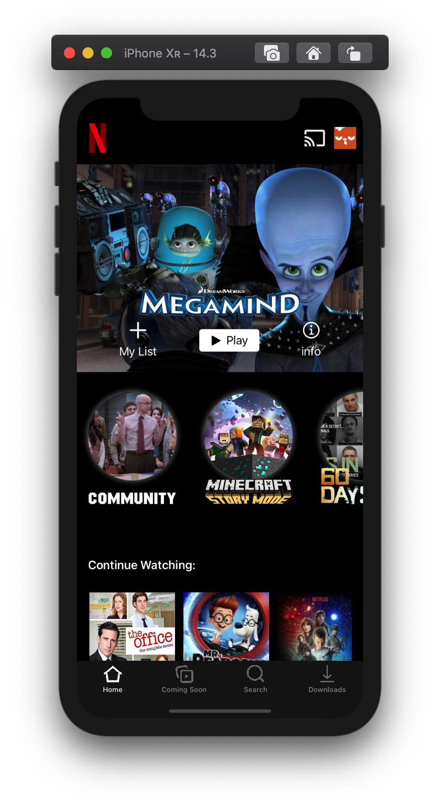
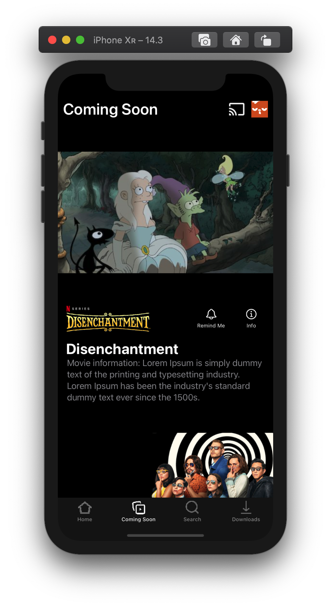
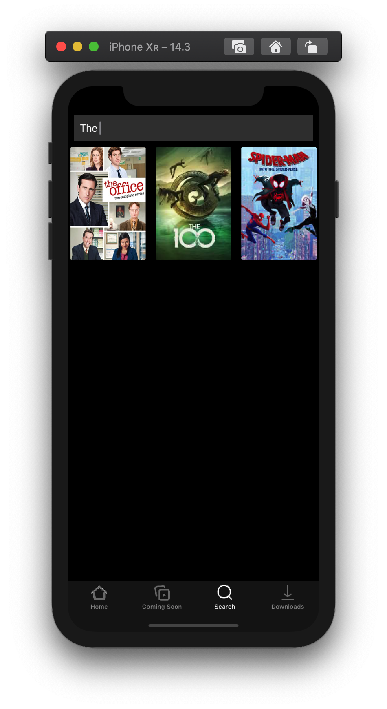
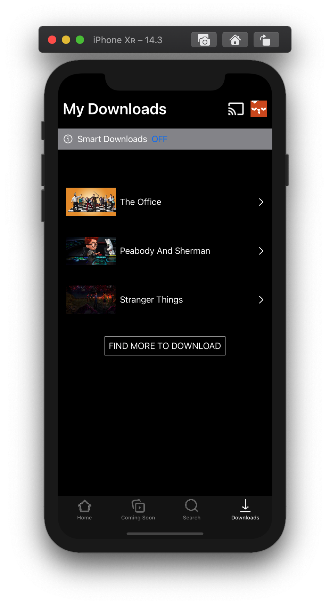
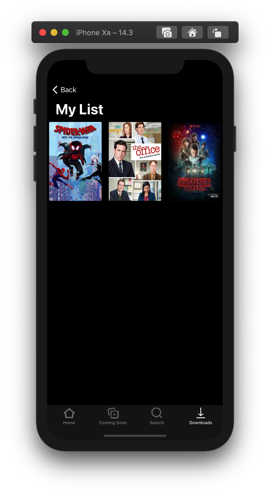
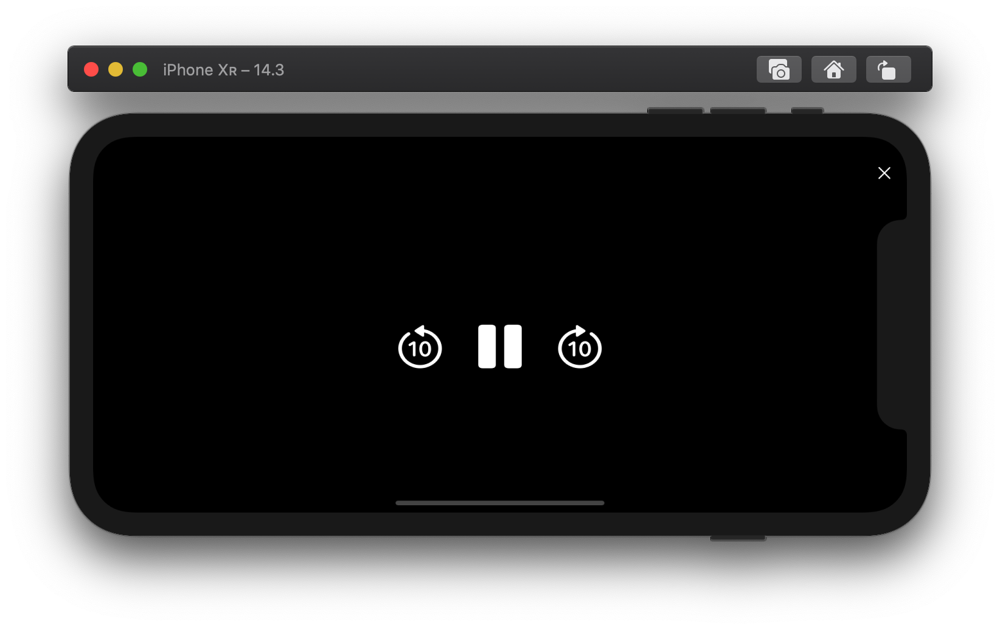
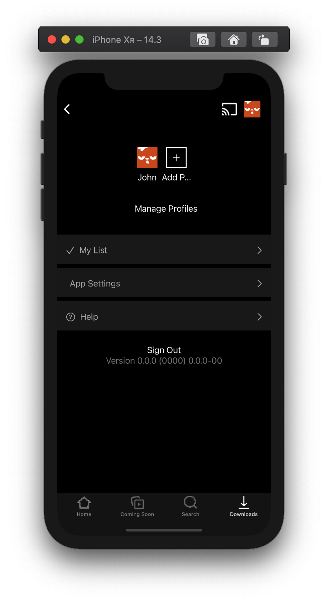
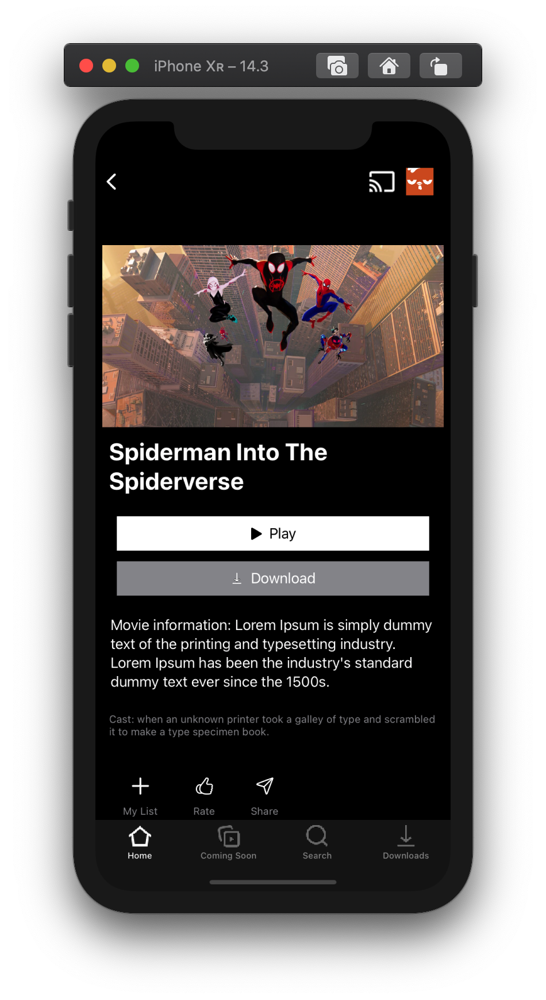

# Netflix SwiftUI

This project is a clone of the Netflix app using SwiftUI with the purpose of understanding the fundamentals of Apple's framework. This is a dummy application, therefore none of the titles presented in the application will actually give you a real show or movie.

*NOTE: This project is for educational purposes, you can use parts of the code base as you want but there are missing features as this is a dummy app. This also means there is no video data in the code base this is purely as a demonstration of SwiftUI's capabilities.*

## How to use:

### Preset:

To run this project you need at least macOS Catalina (Version 10.15) and have [Xcode (Version 12)](https://apps.apple.com/us/app/xcode/id497799835) installed with simulators running iOS 14.

Once you have all the applications, and the proper computer to run it open up the `Netflix SwiftUI.xcodeproj` file and it will launch it in macOS.

### Features:

This application has 4 main pages, the home page, the coming soon page, the search page, and the downloads page. Each page has a certain set of titles with different features.

#### Home:

The home page has a main header like the official Netflix application and has the options to add and watch the currently presented show as can be seen in the screenshot below:



The buttons are all functional, meaning clicking on "my list" will allow it to be added to the list and seen in that view. The "play" button will allow the playing video modal to popup and the info will show more information.

#### Coming Soon:

The coming soon section has 3 titles that display some information similarly to the home and other pages.



#### Search:

The search page allows you to find any of the titles from the main data base and allows you to play them. The amount of titles are very limited so for this application I simply used linear search to just compare the strings together.



#### Downloads:

The downloads page has a dummy few titles, no titles are actually downloaded and it is primarily for show and doesn't have any video data.



### Extra Features:

There are a few extra features in the application such as the "My List" section to add and remove titles you would want to see, playing a movie or show (again as previously stated there is no video data in this project) and a minimal settings page.

#### My List:

Here is the list where all the titles that we're selected to be in the list are presented:



#### Playing A Video:

The video view has some buttons that don't do anything but the close button will close the view when pressed. Additionally, regardless of how the user is holding the phone, it will rotate the screen of the phone when the view is rendered.



#### Settings:

The settings portion of the app is a minimal section with only access to "My List" view and no other core features. To access the settings you would click on the profile picture in the application.



## The Code Structure:

The code as expected is written in Swift with multiple different SwiftUI views and one class that contains helper functions to request data from the data base.

### Core SwiftUI Views:

#### Main Views:

The application as previously stated has 4 main pages that serve as the layout of the application all stored on a `TabView` to allow different pages to be access and using the `NavigationView` and `NavigationLink` structures to go to different pages. All the core views are called `HomeView`, `SearchView`, `DownloadView`, and `ComingSoonView`.

#### Secondary Views:

The home view is split up into 4 different views:

- `HomeHeaderView`: This view is first main title that is presented on the home screen (the input is a number to see which title is being first presented based on the `definitionsKeys` property).
- `HomeCircleListView`: This view is the part where there are some suggestions that are circled in a horizontal scroll view.
- `HomeContinueWatchingView`: These are the titles that the user last watched based on what the data base has it stored as
  - *NOTE: This doesn't update as the user clicks on play titles this is a dummy section that doesn't update.*
- `HomeListView`: This is the section that displays all the different categories for the different titles in the home screen application.

There are 4 other views that support the application:

- `SettingsView`: The settings page that is accessed once the user clicked on the profile picture.
- `MyListView`: This is the view that shows all the different tiles that were selected to be in the list.
- `VideoPlayView`: This is the view that shows when a video is being played (again no real video data is in the application)
- `ItemDataView`: This is the view that shows the different little details about the title.

### Rotating The Screen:

Getting the screen to rotate when a video was being played or closed was a little bit difficult because I wasn't exactly sure where to put it in the code as it could cause crashes.

The solution was simply to run the rotation when the View appeared as presented by the code below:

```swift
// You need to import UIKit and SwiftUI

VStack {
  Text("Hello world!")
}
.onAppear {
  // when the view is loaded:
  
  UINavigationController.attemptRotationToDeviceOrientation()
  // it will force the device to rotate
  
  UIDevice.current.setValue(UIInterfaceOrientation.landscapeLeft.rawValue, forKey: "orientation")
  // and set the new orientation
  
}
```

### Helper Functions:

The main class that contains all the helper functions in this application is named `NetflixHelper` which has methods to access the JSON data. The core methods of this class are as follows:

- `getData`: The function to extract the core data that is used by a lot of the views
- `getImageFromBundle`: The function to get an image from the data base

### The Data:

As previously stated, primary access to the data in the code is done with the method `NetflixHelper.getData()` which returns a JSON object (thanks to SwiftyJSON) and allows the views to read the data. 

The `data.json` file has all the core movies and shows based on their categories, and areas such as downloads, coming soon and other data. The titles are stored as hexadecimal ids with a hashtable to have the name of the title based on the id.

The `data` folder has all the different images for the titles with it's name and 3 different PNG images for either the `title`, `cover`, and `background`.

## More Screenshots:

This is the information card that is rendered when you select on a title:



## Sources:

To run this project you will need the following requirements:

- [Xcode](https://developer.apple.com/xcode/): The IDE that is used to build iOS applications.
- [SwiftUI](https://developer.apple.com/documentation/swiftui): The framework used in the making of this application.

Libraries used for this application:

- [SwiftyJSON](https://github.com/SwiftyJSON/SwiftyJSON): This is a really helpful library to manage JSON data in swift (strongly recommed).

All the pictures were taken from:

- [Netflix INC](https://www.netflix.com/): The netflix website directly
- [Google](https://google.com/): From google images on the first results of certain shows
